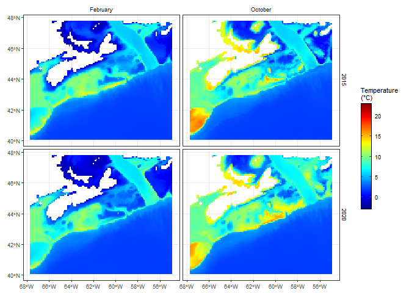
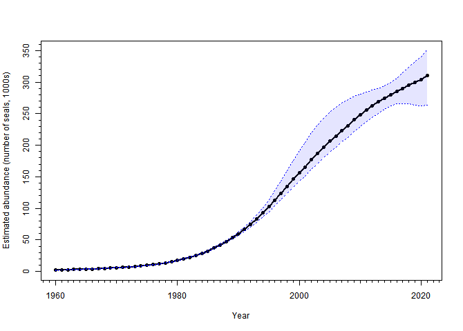

<!--
README.md is generated from README.Rmd. Please edit that file. Build with:
-->


```{r, include = FALSE}
knitr::opts_chunk$set(
  collapse = TRUE,
  comment = "#>",
  fig.path = "man/figures/README-",
  out.width = "70%"
)
library(badger)
library(marea)
```


<!-- badges: start -->
[](https://lifecycle.r-lib.org/articles/stages.html#experimental)
[](https://github.com/MarEcosystemApproaches/marea/actions/workflows/R-CMD-check.yaml)
[](https://codecov.io/gh/MarEcosystemApproaches/marea)
[](https://doi.org/10.5281/zenodo.15706086)
<!-- badges: end -->

# marea </a>

**UNDER DEVELOPMENT**

# Overview


The marea package provides curated maritime ecosystem data and model outputs to support ecosystem approaches to fisheries management in Atlantic Canada. The package standardizes access to environmental variables, oceanographic indices, and biological data from multiple sources.

# Installation

```{r, eval = FALSE}
# Install development version from GitHub
install.packages("remotes")
remotes::install_github("MarEcosystemApproaches/marea")
```

For DFO network users experiencing timeout errors:

```{r, eval = FALSE}
options(timeout = 1200)
remotes::install_github("MarEcosystemApproaches/marea")
```


# Quick Start

```{r, eval = FALSE}
library(marea)

# Plot bottom temperature patterns
plot(glorys_bottom_temperature,
     months = c("February", "October"),
     years = c(2015, 2020))

# Access North Atlantic Oscillation index
plot(nao, lwd = 2)

# View grey seal population trends
plot(grey_seals)
```

# Data Products Available

The marea package includes a variety of datasets and model outputs, including:

```{r, echo = FALSE, message = FALSE, warning = FALSE}
library(knitr)
kable(marea_metadata())
```


# Documentation

Detailed vignettes with examples and methodology:

*links to vignettes*


# Example Visualizations

## Bottom Temperature Comparison

```{r glorystempfig, echo = FALSE}


```

## Grey Seal Population Trends

```{r greysealsfig, echo = FALSE}

```


# Citation

If you use `marea` in your work, please cite:

"Edwards, A.M. et al. (2024). marea: Maritime Ecosystem Approach R Package. 
R package version 1.0.0. https://doi.org/10.5281/zenodo.15706086"

Use `citation("marea")` for BibTeX format.


# Related Work

This package is part of a national effort to facilitate ecosystem approaches to fisheries management:

[pacea](https://github.com/pbs-assess/PACea/) - Pacific ecosystem data

[gslea](https://github.com/duplisea/gslea/) - Gulf of St. Lawrence ecosystem data


# Contributing

Please see our contribution guidelines for information on reporting issues, suggesting enhancements, and contributing code.


# Acknowledgments

We acknowledge funding from Fisheries and Oceans Canada. We thank the data providers and contributors who have made this package possible.

# Contact

For questions or support, please open an issue on GitHub.


