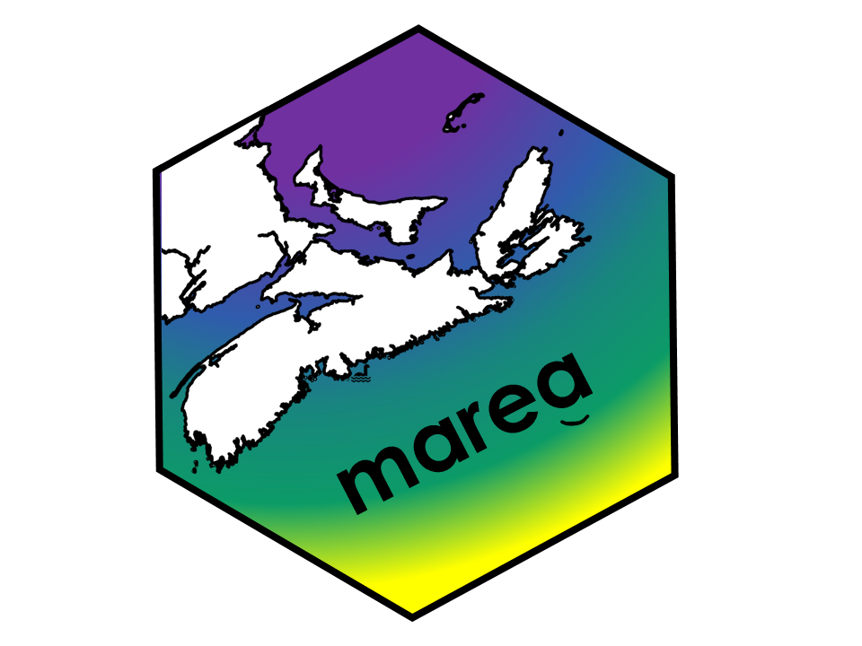

# marea: Curated Ecosystem Data for the Maritimes Region

<!-- badges: start -->
[](https://lifecycle.r-lib.org/articles/stages.html#experimental)
[](https://github.com/MarEcosystemApproaches/marea/actions/workflows/R-CMD-check.yaml)
[](https://codecov.io/gh/MarEcosystemApproaches/marea)
[](https://doi.org/10.5281/zenodo.15706086)
<!-- badges: end -->



`marea` provides curated data sets to support an Ecosystem Approach to Fisheries Management (EAFM) in Canada's Maritimes Region. It offers standardized, analysis-ready time series of oceanographic, environmental, and biological data crucial for research and stock assessment.

## Philosophy


1.  **A Single, Simple Data Structure**: All time series data in `marea` are stored in simple and robust `ea`class objects. This provides a consistent, predictable format, whether you are working with temperature, survey indices, or commercial catch.
2.  **User-Controlled Plotting**: We provide a basic, clean plot for every dataset. From there, **you are in control**. Because our plots are standard `ggplot2` objects, you can easily customize them, add new layers, and create the exact visualization you need for your analysis or report.


## Installation

You can install the development version of `marea` from GitHub:

```r
# install.packages("remotes")
remotes::install_github("MarEcosystemApproaches/marea")
```

For users on the DFO network who may experience connection timeouts:

```r
# Set a longer timeout period
options(timeout = 1200)
remotes::install_github("MarEcosystemApproaches/marea")
```

## Quick Start: A Simple Workflow

The workflow for any dataset in marea is the same: load, inspect, plot, and customize.

```r
library(marea)
library(ggplot2) # For customization

# 1. Load a dataset of interest (e.g., grey seal abundance)
data("grey_seals")

# 2. Inspect the object - it's a clean 'ea_data' object
print(grey_seals)
#> --- Ecosystem Approach (EA) Data Object ---
#> Class:           ea_data 
#> Data Type:       Abundance index 
#> Species:         Grey Seal (Halichoerus grypus) 
#> Location:        Sable Island (Maritimes Region)
#> Time Range:      1962 - 2016 
#> Data Dims:       55 rows x 4 cols 
#> Units:           count 
#> -------------------------------------------
#> Data preview:
#> # A tibble: 6 × 4
#>    year value    low   high
#>   <int> <dbl>  <dbl>  <dbl>
#> 1  1962   363   348.   378.
#> 2  1963   370   355.   385.
#> 3  1964   380   365.   395.
#> 4  1965   390   375.   405.
#> 5  1966   410   395.   425.
#> 6  1967   440   425.   455.

# 3. Create a simple plot
# p <- plot(grey_seals)

```


```r
# 4. Customize it! Add a confidence ribbon and improve the labels.
# The 'low' and 'high' columns are right there in the data frame.
#custom_plot <- base_plot +
 # geom_ribbon(aes(ymin = low, ymax = high), fill = "skyblue", alpha = 0.5) +
  #labs(
   # title = "Grey Seal Abundance on Sable Island",
    #y = "Estimated Pup Production (count)"
  #) +
  #theme_bw()


```

## Available Data

marea includes a growing list of curated data products. Use marea_metadata() to see what's available.

```r
library(knitr)
kable(marea_metadata())
```

## Documentation

For detailed examples, data sources, and methodologies, please see our vignettes:

*Understanding Generic EA Data Classes*: A guide to the ea classes and the package philosophy.

*Plotting EA Classes*: Examples and details of how to plot ea class objects.

## Citation

If you use marea in a publication, please cite it. You can get the current citation information by running:

```r
citation("marea")
```

## Contributing

We welcome contributions! If you have suggestions, find a bug, or would like to contribute a new dataset, please see our contribution guidelines and open an issue on GitHub.

## Related Work

This package is part of a coordinated effort across DFO regions to standardize access to ecosystem data for fisheries management:

[pacea](https://github.com/pbs-assess/PACea/) - Pacific ecosystem data

[gslea](https://github.com/duplisea/gslea/) - Gulf of St. Lawrence ecosystem data


## Acknowledgments

We acknowledge that this work is done in the traditional and unceded territory of indigenous people who have cared for this land and water for time immemorial. We thank Fisheries and Oceans Canada for funding and acknowledge the many data providers and scientists whose work makes this package possible. 

Special thanks to the oce package team for inspiring the design of the `ea` class system.

Kelley D, Richards C (2025). oce: Analysis of Oceanographic Data. R package version 1.8-4, https://dankelley.github.io/oce/.