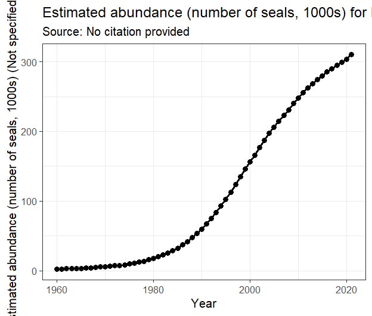

# marea: Curated Ecosystem Data for the Maritimes Region

<!-- badges: start -->

[](https://lifecycle.r-lib.org/articles/stages.html#experimental)
[](https://github.com/MarEcosystemApproaches/marea/actions/workflows/R-CMD-check.yaml)
[](https://codecov.io/gh/MarEcosystemApproaches/marea)
[](https://doi.org/10.5281/zenodo.15706086)
<!-- badges: end -->


`marea` provides curated data sets to support an Ecosystem Approach to
Fisheries Management (EAFM) in Canada’s Maritimes Region. It offers
standardized, analysis-ready time series of oceanographic,
environmental, and biological data crucial for research and stock
assessment.

## Philosophy

1.  **A Single, Simple Data Structure**: All time series data in `marea`
    are stored in simple and robust `ea`class objects. This provides a
    consistent, predictable format, whether you are working with
    temperature, survey indices, or commercial catch.
2.  **User-Controlled Plotting**: We provide a basic, clean plot for
    every dataset. From there, **you are in control**. Because our plots
    are standard `ggplot2` objects, you can easily customize them, add
    new layers, and create the exact visualization you need for your
    analysis or report.

## Installation

You can install the development version of `marea` from GitHub:

``` r
# install.packages("remotes")
remotes::install_github("MarEcosystemApproaches/marea")
```

For users on the DFO network who may experience connection timeouts:

``` r
# Set a longer timeout period
options(timeout = 1200)
remotes::install_github("MarEcosystemApproaches/marea")
```

## Quick Start: A Simple Workflow

The workflow for any dataset in marea is the same: load, inspect, plot,
and customize.

``` r
library(marea)
```

    ## Thank you for using marea. Type citation('marea') for citation information.

``` r
library(ggplot2) # For customization

# 1. Load a dataset of interest (e.g., grey seal abundance)
data("grey_seals")

# 2. Inspect the object - it's a clean 'ea_data' object
ea.print(grey_seals)
```

    ## --- Ecosystem Approach (EA) Data Object --- 
    ## Class:  ea_data 
    ## Data Type:  Estimated abundance (number of seals, 1000s) 
    ## Location:    ( Maritimes  Region ) 
    ## Time Range:   1960  -  2021 
    ## Units:  Not specified 
    ## --------------------------------------------
    ## Data Preview:
    ##   year      low    value     high
    ## 1 1960 1.652570 1.860824 2.396134
    ## 2 1961 2.032521 2.263192 2.809171
    ## 3 1962 2.407304 2.659018 3.214911
    ## 4 1963 2.700793 2.972982 3.541202
    ## 5 1964 2.785795 3.088971 3.684344
    ## 6 1965 3.126289 3.449040 4.053713

``` r
# 3. Create a simple plot
 p <- plot(grey_seals)
```



You can use the style argument to create a default whichis an
appropriate base for your data, then customize it even further by
chaining on ggplot graphics grammar.

``` r
# 4. Customize it! Add a confidence ribbon and improve the labels.
# The 'low' and 'high' columns are right there in the data frame.
custom_plot <- plot(grey_seals, style = 'ribbon') +
  labs(
   title = "Grey Seal Abundance on Sable Island",
    y = "Estimated Pup Production (count)"
  ) +
  theme_bw()
```


## Available Data

marea includes a growing list of curated data products. Use
marea_metadata() to see what’s available.

``` r
library(knitr)
kable(marea_metadata())
```

| Dataset                   | Region                      | TimeSpan  | Source                                                                                           |
|:--------------------------|:----------------------------|:----------|:-------------------------------------------------------------------------------------------------|
| amo                       | Northern Hemisphere (0-60N) | 1854-2025 | NOAA , <https://www1.ncdc.noaa.gov/pub/data/cmb/ersst/v5/index/ersst.v5.amo.dat>                 |
| ao                        | Northern Hemisphere         | 1950-2025 | NOAA CPC, <https://www.cpc.ncep.noaa.gov/products/precip/CWlink/daily_ao_index/>                 |
| azmp_bottom_temperature   | Scotian Shelf (4X, 4V, 4W)  | 1950-2024 | DFO Atlantic Zone Monitoring Program via azmpdata                                                |
| food_habits               | Not specified               | 1995-2016 | pacea object                                                                                     |
| glorys_bottom_temperature | Northwest Atlantic          | Unknown   | CMEMS Global Ocean Physics Reanalysis                                                            |
| grey_seals                | Maritimes                   | 1960-2021 | No citation provided                                                                             |
| grey_seals_2021           | Maritimes                   | 1960-2021 | No citation provided                                                                             |
| mei                       | Equatorial Pacific          | 1979-2025 | NOAA ESRL/PSL, <https://psl.noaa.gov/enso/mei/>                                                  |
| nao                       | North Atlantic              | 1951-2024 | NOAA NCEP via azmpdata; <https://www.ncei.noaa.gov/access/monitoring/nao/>                       |
| npgo                      | North Pacific Gyre          | 1950-2025 | Di Lorenzo et al., <http://www.o3d.org/npgo/>                                                    |
| oni                       | Niño 3.4 Region (Pacific)   | 1950-2025 | NOAA CPC, <https://www.cpc.ncep.noaa.gov/products/analysis_monitoring/ensostuff/ensoyears.shtml> |
| pdo                       | North Pacific               | 1854-2025 | NOAA ERSST, <https://www.ncei.noaa.gov/access/monitoring/pdo/>                                   |
| soi                       | Equatorial Pacific          | 1951-2025 | NOAA CPC, <https://www.cpc.ncep.noaa.gov/data/indices/soi>                                       |

## Documentation

For detailed examples, data sources, and methodologies, please see our
vignettes:

*Understanding Generic EA Data Classes*: A guide to the ea classes and
the package philosophy.

*Plotting EA Classes*: Examples and details of how to plot ea class
objects.

## Citation

If you use marea in a publication, please cite it. You can get the
current citation information by running:

``` r
citation("marea")
```

## Contributing

We welcome contributions! If you have suggestions, find a bug, or would
like to contribute a new dataset, please see our contribution guidelines
and open an issue on GitHub.

[CONTRIBUTING](CONTRIBUTING.md)

## Related Work

This package is part of a coordinated effort across DFO regions to
standardize access to ecosystem data for fisheries management:

[pacea](https://github.com/pbs-assess/PACea/) - Pacific ecosystem data

[gslea](https://github.com/duplisea/gslea/) - Gulf of St. Lawrence
ecosystem data

## Acknowledgments

We acknowledge that this work is done in the traditional and unceded
territory of indigenous people who have cared for this land and water
for time immemorial. We thank Fisheries and Oceans Canada for funding
and acknowledge the many data providers and scientists whose work makes
this package possible.

Special thanks to the oce package team for inspiring the design of the
`ea` class system.

Kelley D, Richards C (2025). oce: Analysis of Oceanographic Data. R
package version 1.8-4, <https://dankelley.github.io/oce/>.
